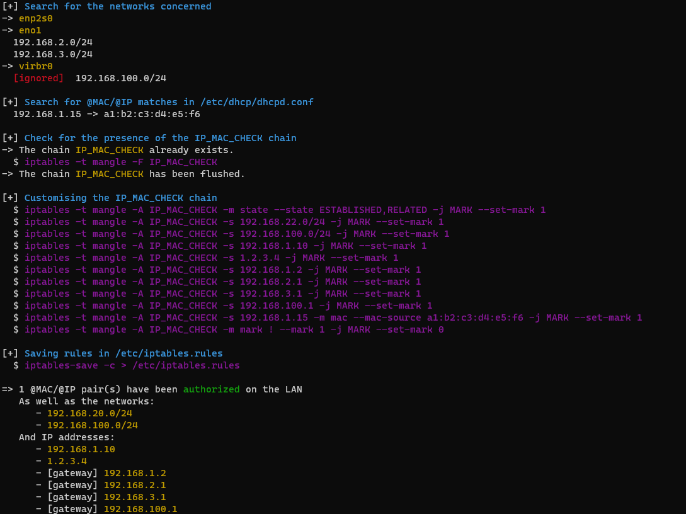

# ARPdefender

It allows you to counter ARP spoofing with iptables (and ISC-DHCP).

An article about this tool was written on [Cyberzen's blog](https://blog.cyberzen.com/Countering%20ARP%20spoofing%20with%20iptables%20-%2020231219.html).


## I) Preparation

The script was created using Iptables to manage Netfilter and ISC-DHCP as the DHCP service solution.

3 Kernel modules are required for the script to work properly:

- CONFIG_NETFILTER_XT_MATCH_MAC : to compare MAC addresses in rules
- CONFIG_NETFILTER_XT_MARK : to define markers on rules
- CONFIG_NETFILTER_XT_MATCH_MARK : to compare markers on rules

To check that these modules are activated or can be activated, simply use the following command:

```bash
$ cat /boot/config-`uname -r` | grep [MODULE] | grep "y\|m"
```


## II) Usage

The script must be run on a Linux environment.

```bash
# Obtain permission to run the script
$ chmod +x arpdefender.sh

# Run the script
$ ./arpdefender.sh
```

The rules will be set up by the script and all the rules will be saved at the end in */etc/iptables.rules*.


## III) Example

<u>Data</u>

- Primary interface : enp2s0 (192.168.1.2)
- Network to whitelist : `declare -a EXCEPTIONS=( "100" )`  (192.168.100.0/24)
- @IP to whitelist : `declare -a IP_ALLOWED=( "10" "1.2.3.4" )` (10 -> 192.168.1.10/32)
- Secondary interface : eno1 (192.168.2.1 & 192.168.3.1)
- @MAC a1:b2:c3:d4:e5:f6 associated with @IP 192.168.1.15 (*/etc/dhcp/dhcpd.conf*)

<u>Output</u>




## IV) Details

### A) Versioning

| Version |    Date    |             Content             |
| :-----: | :--------: | :-----------------------------: |
|   1.0   | 19/12/2023 | @MAC / @IP filtering management |

### B) Contact

Author: [Jérémy DE COCK | LinkedIn](https://www.linkedin.com/in/jeremy-dc/)

Cyberzen: https://www.cyberzen.com/ | [contact@cyberzen.com](mailto:contact@cyberzen.com)

Project link: https://github.com/CyberzenFr/CyberzenFr/tree/main/ARPdefender

### C) License

Distributed under GPLv3 Licence. See `LICENSE.txt` for more information.