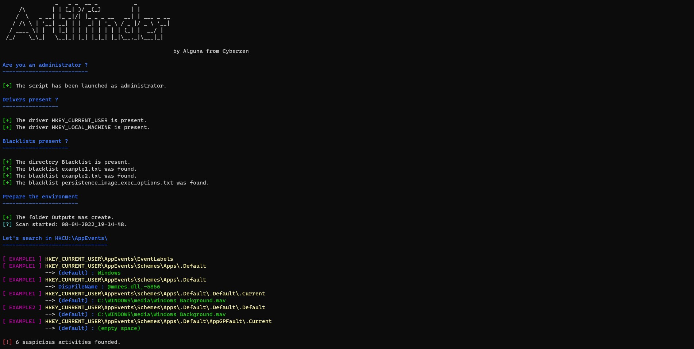
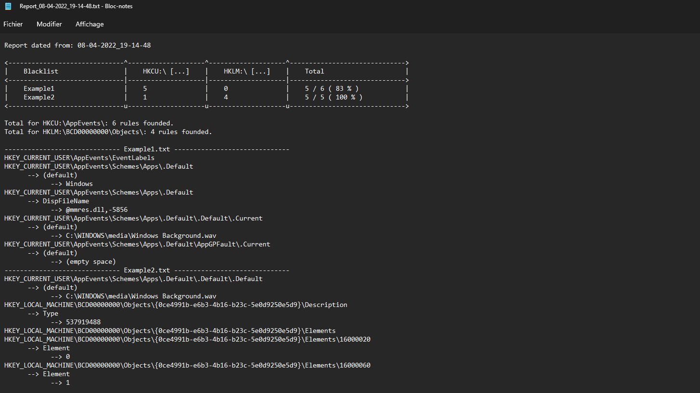

# Arti'finder

It allows you to investigate a Windows machine and look for possible artifacts that may have been left behind after its infection.

An article about this tool was written on [Cyberzen's blog](https://blog.cyberzen.com/A-la-recherche-d-artefacts-sur-Windows-via-Powershell.html).


## I) Preparation

At least, you must have the `arti_finder.ps1` script in a directory containing all the rights and have a `Blacklists` directory containing all the rules you want to test.

The format of the rules files is as follows:

- [title] : must be followed by the **name of the rules category** (ransomware? exploit?)
- [rules] : must be followed by the **total rule number** present in the file.
- [name] : must be followed by the **name of the registry key**.
- [property] : must be followed by a **property name** for this key.
- [value] : must be followed by the **value of this property**.

Example:

```
# Fake example
[title]Demonstration
[rules]5
[name]HKEY_CURRENT_USER\AppEvents\Schemes\Apps\.Default
    [property](default)
        [value]Windows
    [property]DispFileName
        [value]@mmres.dll,-5856
[name]HKEY_CURRENT_USER\AppEvents\Schemes\Apps\.Default\AppGPFault\.Current  
    [property](default)
[name]HKEY_LOCAL_MACHINE\SOFTWARE\Microsoft\Windows NT\CurrentVersion\SilentProcessExit\notepad.exe
    [property]MonitorProcess
        [value]C:\temp\evil.exe
```

You can in your rules:

- put comments starting with '#', they will be ignored.
- put registry key without property and property without value.
- put multiple properties (with or without value) for the same registry key.


## II) Usage

The script must be launched in a **Powershell** window as an administrator.

```powershell
PS C:\Users\demo\Documents\Arti_finder> ls


    Répertoire : C:\Users\demo\Documents\Arti_finder


Mode                 LastWriteTime         Length Name
----                 -------------         ------ ----
d-----        11/05/2022     00:50                Blacklists
d-----        11/05/2022     11:23                Outputs
d-----        11/05/2022     14:07                Reports
d-----        11/05/2022     14:10                Screens
-a----        11/05/2022     02:41          24983 arti_finder.ps1
-a----        11/05/2022     14:08            181 Readme.md

PS C:\Users\demo\Documents\Arti_finder> .\arti_finder.ps1
```

The execution time will depend on the paths analyzed exactly in the two drivers **HKCU:/** and **HKLM:/**.


## III) Example

In this demo, I analyzed:

- HKCU:\AppEvents\
- HKLM:\BCD00000000\Objects\

<u>Result in the terminal</u>




<u>Result in the report file</u>




## IV) Details

### A) Versioning

| Version |    Date    |                           Content                            |
| :-----: | :--------: | :----------------------------------------------------------: |
|   1.0   | 05/11/2022 | Basic scan of drivers HKCU and HKLM (use blacklist to compare values founded). |

### B) Contact

Author: [Jérémy DE COCK | LinkedIn](https://www.linkedin.com/in/jeremy-dc/)

Cyberzen: https://www.cyberzen.com/ | [contact@cyberzen.com](mailto:contact@cyberzen.com)

Project link: https://github.com/CyberzenFr/CyberzenFr/tree/main/Arti_finder

### C) License

Distributed under GPLv3 Licence. See `LICENSE.txt` for more information.